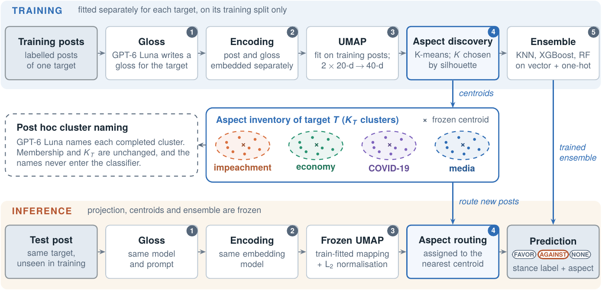
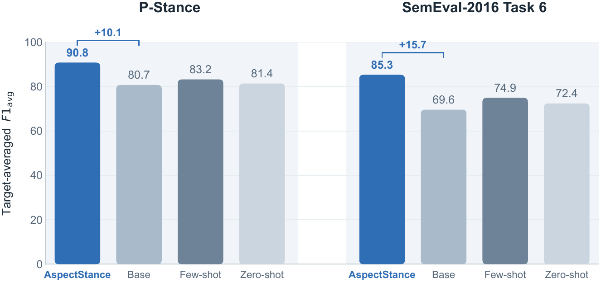

<div align="center">

# AspectStance: Implementation

### Unsupervised discovery of target-specific aspects for stance detection

Reference implementation of<br>
**AspectStance: Unsupervised Discovery of Target-Specific Aspects for Stance Detection**<br>
Milad Allahgholi and Hossein Rahmani, School of Computer Engineering, Iran University of Science and Technology


</div>

---

A post about a presidential candidate is rarely about the candidate *in general*. It is about a
debate, a health-care plan, a fundraising appeal or a scandal. Stance detection still asks for one
verdict on the whole target (`FAVOR`, `AGAINST` or `NONE`), so criticism of a candidate's economic
policy and criticism of their personal conduct both collapse to `AGAINST`.

**AspectStance** discovers, for every target and without any aspect annotation, an inventory of
*latent aspects*. It routes each post to one of them and conditions a stance classifier on that
aspect, so **every prediction is returned together with the aspect that conditioned it**.

<p align="center">
  
</p>

## Contents

- [Highlights](#highlights)
- [The method](#the-method)
- [Results reported in the paper](#results-reported-in-the-paper)
- [Installation](#installation)
- [Running the pipeline](#running-the-pipeline)
- [Using a trained model](#using-a-trained-model)
- [What a run writes](#what-a-run-writes)
- [Paper-to-code map](#paper-to-code-map)
- [Implementation decisions the paper leaves open](#implementation-decisions-the-paper-leaves-open)
- [Why an explicit partition helps, and what it is not](#why-an-explicit-partition-helps-and-what-it-is-not)
- [Project layout](#project-layout)
- [Citation](#citation)

---

## Highlights

- **Aspects without aspect labels.** A target-specific aspect inventory is induced from each post
  and an LLM-written, target-conditioned gloss of it. Benchmarks annotate only the target, and the
  method needs nothing more.
- **Inventory size chosen by the data.** K-means runs for every $K \in \{2,\dots,30\}$ and the
  partition with the highest cosine silhouette is kept, separately for each target.
- **Same rule for training and inference.** The UMAP mapping and the centroids are frozen after
  training, so a new post is routed exactly like the training posts around it.
- **Interpretable output.** Each stance label comes with the index (and, after naming, the name) of
  the aspect cluster that conditioned it.
- **Every control in the paper is built in.** One command runs the ten-seed protocol: AspectStance,
  the Base Method ablation, the 160-run random-clustering control and the invariance checks. The two
  GPT-6 Luna prompting baselines have their own command.

## The method

Everything is fitted **per target, on that target's training split only**. Projection, centroids
and ensemble are then frozen and reused at inference.

| # | Stage | What happens | Paper |
|:-:|---|---|:-:|
| 1 | **Gloss** | GPT-6 Luna writes a 30-50-word, target-conditioned explanation of the post: $\tilde{x}=g(x,T)$ | §4.2, Fig. 2 |
| 2 | **Encoding** | post and gloss are embedded *separately* with `text-embedding-3-large` (3,072-d): $e=E(x)$, $\tilde{e}=E(\tilde{x})$ | §4.3, Eq. 5 |
| 3 | **Shared UMAP** | one mapping $U$ per target, fitted on the training **posts** only, reduces both views to 20-d: $v=[U(e);\ U(\tilde{e})]\in\mathbb{R}^{40}$ | Eqs. 6-7 |
| 4 | **Aspect discovery** | K-means on $\hat{v}=v/\lVert v\rVert_2$ for every $K\in\{2,\dots,30\}$; the partition with the highest **cosine silhouette** is kept and its centroids $\mu_{T,k}$ are frozen | §4.4, Eq. 8 |
| 5 | **Aspect-conditioned ensemble** | KNN + XGBoost + random forest (library defaults), equal-weight **soft voting** on $z=[v;\ \mathrm{onehot}(c)]\in\mathbb{R}^{40+K_T}$ | Eqs. 9-11 |
| 6 | **Inference** | frozen $U$, then the nearest frozen centroid $k^{*}=\arg\min_k\lVert\hat{v}-\mu_{T,k}\rVert_2$, then the ensemble; returns **(stance, aspect)** | Eqs. 12-13 |
| - | *Naming* | GPT-6 Luna names each finished cluster. Names are for people: they never move a post, change $K_T$ or enter the classifier | §4.5 |

The soft vote of Eq. (10) averages the three members' class distributions with equal weight:

$$\hat{y}=\arg\max_{y\in\mathcal{Y}_T}\ \frac{1}{3}\sum_{m=1}^{3}p_m\!\left(y \mid [v;\ \mathrm{onehot}(k^{*}(x))]\right)$$

Two details are easy to get wrong, and the code follows the paper exactly on both:

* **L2 normalisation is only for clustering and routing.** The classifier always receives the
  *unnormalised* 40-d vector $v$.
* **One UMAP mapping, two views.** The training posts keep their fitted UMAP coordinates. The
  glosses, and at inference both views of every new post, go through the *same frozen mapping*,
  so $r$ and $\tilde{r}$ share one coordinate system.

**Compared methods (§5.3)**

| Method | What it is |
|---|---|
| **Base Method** | the same ensemble on $v$ alone. It shares the glosses, embeddings and the UMAP mapping of the same run, so the one-hot cluster block is the only design difference |
| **Random clustering** | the K-means partition is replaced by a uniformly random one, $K=5,\dots,20$ with ten draws each: **160 complete runs per target**. Test posts are routed to the nearest random centroid, and the best test score per target is reported, a choice that favours this control |
| **Invariance checks** | cluster indices are relabelled, and the one-hot columns permuted, consistently in training and test |
| **Zero-shot prompting** | GPT-6 Luna predicts the stance directly, with no examples |
| **Retrieval-augmented few-shot** | for each label, the five most similar training posts of the same target (cosine over `text-embedding-3-large`) are added to the prompt |

## Results reported in the paper

Target-averaged $F1_{avg}$ is the mean of the FAVOR and AGAINST F1 scores, averaged with equal
weight over targets ($F\text{-}macro_T$). AspectStance and the Base Method are means over ten seeded
runs, and the prompting baselines are means over ten passes.

<p align="center">
  
</p>

| Target | AspectStance | Base | Δ | | Target | AspectStance | Base | Δ |
|---|---:|---:|---:|---|---|---:|---:|---:|
| Trump | 91.6 | 82.1 | +9.5 | | Atheism | 88.9 | 74.2 | +14.7 |
| Biden | 90.9 | 80.7 | +10.2 | | Legalization of Abortion | 87.4 | 71.3 | +16.1 |
| Sanders | 89.9 | 79.3 | +10.6 | | Hillary Clinton | 85.9 | 69.8 | +16.1 |
| | | | | | Feminist Movement | 84.2 | 67.9 | +16.3 |
| | | | | | Climate Change | 80.2 | 64.8 | +15.4 |
| **P-Stance** | **90.8** | **80.7** | **+10.1** | | **SemEval-2016** | **85.3** | **69.6** | **+15.7** |

| Clustering-strategy control (Table 4) | P-Stance | Δ | SemEval-2016 | Δ |
|---|---:|---:|---:|---:|
| K-means (**AspectStance**) | **90.8** | - | **85.3** | - |
| Random, best of 160 | 75.7 | -15.1 | 74.1 | -11.2 |
| None (Base Method) | 80.7 | -10.1 | 69.6 | -15.7 |

| Prompting baselines (GPT-6 Luna) | P-Stance | SemEval-2016 |
|---|---:|---:|
| Retrieval-augmented few-shot | 83.2 | 74.9 |
| Zero-shot | 81.4 | 72.4 |

**Induced inventories (Tables 5-6).** Trump K = 16, Biden 12, Sanders 9, Atheism 5, Climate
Change 5, Feminist Movement 5, Hillary Clinton 6 and Legalization of Abortion 5. Cosine silhouettes
range from 0.85 to 0.94, and every seed selected the same K. Most aspects are recognisable subtopics,
such as impeachment, COVID-19, immigration, fundraising, debates, Gamergate, or courts and
legislation. The cluster assignments of every training post are released in
[`../Clustering Results (Aspects)`](../Clustering%20Results%20%28Aspects%29); `python -m aspectstance released`
lists them next to the paper's aspect names.

## Installation

```bash
cd "AspectStance Implementation"
pip install -r requirements.txt     # numpy, pandas, scikit-learn, umap-learn, xgboost, openai, ...
# or as a package that also provides the `aspectstance` command:
pip install -e .
# optional offline encoder, for runs without an API key:
pip install -e ".[offline]"
```

Python 3.9 or newer. The commands below run from this folder as `python -m aspectstance ...`; after
`pip install -e .` the shorter `aspectstance ...` works too. The paper's backends need an
`OPENAI_API_KEY`.

**Data.** Tweet texts are not redistributed. Obtain the benchmarks from their original releases:

| Benchmark | Source | Files the loader reads |
|---|---|---|
| P-Stance (Li et al., 2021) | [github.com/chuchun8/PStance](https://github.com/chuchun8/PStance) | `raw_{train,test}_{trump,biden,bernie}.csv` with `Tweet, Target, Stance` |
| SemEval-2016 Task 6, Subtask A | [saifmohammad.com/WebPages/StanceDataset.htm](https://www.saifmohammad.com/WebPages/StanceDataset.htm) | trial + training files and the gold test file: the official tab-separated `.txt`, or CSV/XLSX with `ID, Target, Tweet, Stance` |

## Running the pipeline

Each stage reads and writes one **workspace** folder (git-ignored, because it holds tweet texts).

```bash
export OPENAI_API_KEY=sk-...
W=workspace/semeval

# 1. canonical table: id, dataset, target, split, text, label
python -m aspectstance prepare   -w $W --dataset semeval2016 \
    --semeval-train data/semeval2016-task6-trialdata.txt data/semeval2016-task6-trainingdata.txt \
    --semeval-test  data/SemEval2016-Task6-subtaskA-testdata-gold.txt

# 2-3. glosses (GPT-6 Luna, medium reasoning effort) and embeddings (text-embedding-3-large)
python -m aspectstance enrich    -w $W
python -m aspectstance embed     -w $W

# 4-6. the ten-seed protocol: AspectStance, Base Method, random control, invariance checks
python -m aspectstance run       -w $W --jobs 4

# post hoc aspect names and the two prompting baselines
python -m aspectstance name      -w $W --results openai --seed 0
python -m aspectstance baselines -w $W --mode zero-shot
python -m aspectstance baselines -w $W --mode few-shot
```

For P-Stance, prepare with
`python -m aspectstance prepare -w workspace/pstance --dataset pstance --pstance-dir data/PStance`
and run the same stages. [`scripts/reproduce_paper.sh`](scripts/reproduce_paper.sh) runs everything
for both benchmarks.

Every API response is cached in `<workspace>/cache.sqlite`, keyed by the content of the request, so
an interrupted stage resumes where it stopped. As in the paper, glosses and embeddings are created
**once** and reused by all ten seeds.

| Stage | API calls |
|---|---|
| `enrich` | one GPT-6 Luna call per post: 4,163 for SemEval-2016, 19,400 for P-Stance (train + test) |
| `embed` | two embeddings per post (post and gloss), in batches of 256 |
| `name` | one call per cluster of one run (63 clusters in the paper's run) |
| `baselines` | one call per test post per pass: 10 x 1,249 (SemEval-2016) or 10 x 2,176 (P-Stance) per baseline |

**Without an API key.** `enrich --backend template` and `embed --backend wordllama` (or `lsa`) are
offline stand-ins that let every stage run without network access. They are not the paper's models:
the template gloss adds no background knowledge, and the encoders are far weaker than
`text-embedding-3-large`, so they cannot reproduce the paper's numbers.

<details>
<summary><b>Command reference</b></summary>

| Command | Purpose | Key options |
|---|---|---|
| `prepare` | load a benchmark into the canonical table | `--dataset`, `--pstance-dir`, `--semeval-train`, `--semeval-test`, `--include-val`, `--holdout-fraction` (only for data without a test split; not the paper's protocol) |
| `enrich` | one gloss per post | `--backend openai\|template`, `--model gpt-6-luna`, `--reasoning-effort medium`, `--api responses\|chat`, `--workers`, `--limit N` (preview) |
| `embed` | encode posts and glosses | `--backend openai\|wordllama\|lsa`, `--embedding-model`, `--batch-size` |
| `run` | the full evaluation protocol | `--seeds 0-9`, `--jobs`, `--targets`, `--config configs/paper.yaml`, `--no-random-control`, `--no-invariance`, `--name` |
| `report` | re-render the summary of a finished run | `results/<name>` |
| `name` | post hoc cluster naming | `--results`, `--seed`, `--max-posts` |
| `baselines` | zero-shot / retrieval-augmented few-shot prompting | `--mode`, `--passes 10`, `--per-label 5` |
| `fit` | train deployable per-target models | `--seed`, `--targets`, `--names aspect_names_seed0.csv` |
| `predict` | stance + aspect for new posts | `models/<target>/seed<k>.joblib --input posts.csv` |
| `released` | the released aspect assignments next to Tables 5-6 | `--root "../Clustering Results (Aspects)"` |

All hyperparameters are in [`configs/paper.yaml`](configs/paper.yaml), which holds exactly the values
reported in the paper. Every setting not listed there runs at the scikit-learn / XGBoost defaults.

</details>

## Using a trained model

```bash
python -m aspectstance fit -w workspace/semeval --seed 0 \
    --names workspace/semeval/results/openai/aspect_names_seed0.csv
python -m aspectstance predict workspace/semeval/models/Hillary_Clinton/seed0.joblib \
    --input new_posts.csv --output predictions.csv
```

`predictions.csv` gets one row per post with its `gloss`, `stance`, `aspect_cluster`, `aspect_name`
and the soft-vote probabilities `p_favor`, `p_against`, `p_none`.

From Python:

```python
from aspectstance import AspectStanceModel

model = AspectStanceModel("Hillary Clinton", random_state=0)   # paper hyperparameters by default
model.fit(post_embeddings, gloss_embeddings, labels)           # training split of one target
print(model.n_aspects, model.silhouette)                       # selected K and its cosine silhouette

pred = model.predict(new_post_embeddings, new_gloss_embeddings)
pred.labels         # stance towards the target
pred.clusters       # index of the aspect that conditioned each prediction
pred.probabilities  # equal-weight soft vote of KNN, XGBoost and the random forest
```

`AspectStanceModel(..., use_cluster_feature=False)` gives the Base Method.

## What a run writes

```
<workspace>/results/<name>/
├── summary.md / summary.json        the paper's tables for this run (Tables 3-6 layout)
├── metrics_per_seed.csv             F1_FAVOR, F1_AGAINST, F1_avg per target x seed x method, with K and silhouette
├── random_control_runs.csv          the 160 random-clustering runs per target
├── invariance.csv                   relabelled clusters / permuted one-hot columns
├── inventory.csv                    cluster sizes, shares and stance counts per seed
├── sweep_scores.csv                 the silhouette curve over K = 2..30 per seed
├── pooled_f_micro_per_seed.csv      pooled F-micro_T (the official SemEval ranking), for reference
├── predictions/<target>/seed<k>.csv test predictions of AspectStance and Base with the routed cluster
├── assignments/<target>/seed<k>.csv cluster of every training and test post
└── run_config.json                  configuration, backends and evaluation protocol
```

Result files hold post ids, labels and clusters only, never tweet texts.

## Paper-to-code map

| Paper | Code |
|---|---|
| Enrichment prompt (Fig. 2), $\tilde{x}=g(x,T)$ (Eq. 4) | [`prompts.ENRICHMENT_PROMPT`](aspectstance/prompts.py), [`enrichment.generate_glosses`](aspectstance/enrichment.py) |
| GPT-6 Luna calls with medium reasoning effort (§5.4) | [`llm.LLMClient`](aspectstance/llm.py) |
| `text-embedding-3-large`, Eq. 5 | [`embeddings.OpenAIEmbedder`](aspectstance/embeddings.py) |
| Shared UMAP, $v=[r;\tilde{r}]\in\mathbb{R}^{40}$ (Eqs. 6-7) | [`representation.SharedUMAP`](aspectstance/representation.py) |
| $L_2$ normalisation (Eq. 8) | [`representation.l2_normalise`](aspectstance/representation.py) |
| K-means and cosine-silhouette sweep, K = 2..30 (§4.4) | [`clustering.silhouette_sweep`](aspectstance/clustering.py) |
| Post hoc naming (§4.5, App. A.1) | [`naming.name_clusters`](aspectstance/naming.py), [`prompts.NAMING_PROMPT`](aspectstance/prompts.py) |
| $z=[v;\mathrm{onehot}(c)]$ (Eq. 9) | [`classifier.with_cluster_feature`](aspectstance/classifier.py) |
| KNN + XGBoost + RF soft voting (Eqs. 10-11) | [`classifier.SoftVotingEnsemble`](aspectstance/classifier.py) |
| Routing $k^{*}(x)$ (Eq. 12) and prediction (Eq. 13) | [`clustering.NearestCentroidRouter`](aspectstance/clustering.py), [`model.AspectStanceModel`](aspectstance/model.py) |
| $F1_{avg}$, $F\text{-}macro_T$, $F\text{-}micro_T$ (§5.2, Eq. 14) | [`metrics`](aspectstance/metrics.py) |
| Base Method, random-clustering control, invariance checks (§5.3, §6.2) | [`experiment.run_target_seed`](aspectstance/experiment.py) |
| Zero-shot and retrieval-augmented few-shot baselines (App. A.2-A.3) | [`baselines`](aspectstance/baselines.py) |
| Ten-seed protocol (§5.4) | [`experiment.run_experiments`](aspectstance/experiment.py), [`report`](aspectstance/report.py) |
| Aspect inventories (Tables 5-6) | `inventory.csv`, [`released`](aspectstance/released.py) |

## Implementation decisions the paper leaves open

The paper fixes the models, every reported hyperparameter and the protocol. Where it is silent, the
code makes the following choices. Each one is documented in the code and easy to change.

1. **Seeds.** Ten seeds, `0-9`. A seed drives UMAP, the K-means sweep and the random forest. KNN
   and XGBoost are deterministic given their input.
2. **Random-control pairing.** Random draw *j* reuses the representation (the UMAP mapping) of the
   *j*-th seeded run, and its random assignment comes from a generator seeded with `(draw, K)`. The
   control therefore changes nothing but the partition.
3. **Silhouette ties** go to the smaller K.
4. **Prompt payloads.** The naming prompt lists a cluster's posts as `- post` lines. Few-shot
   examples are written as `Tweet: "..." | Target: "..." | Label: ...`, grouped by label and most
   similar first.
5. **Unparseable LLM answers** in the prompting baselines are scored as `INVALID`, which counts as
   an error. Each of the ten passes has its own cache namespace, so the passes are independent calls.
6. **XGBoost runs on one thread**, so results are identical for any `--jobs`. The thread count does
   not change the model.
7. **The P-Stance validation split is skipped** (`--include-val` loads it), because the paper never
   uses it.

## Why an explicit partition helps, and what it is not

The cluster feature adds no new observation: it is a deterministic function of $v$, which the
ensemble already receives. The paper (§7.1) attributes the gain to three complementary effects:

- **Discretisation as an inductive bias.** Trees can split on the one-hot block directly, and it
  changes the distances the KNN member computes. Finite-sample learners at default settings would
  otherwise have to reconstruct the partition from continuous coordinates.
- **Geometry-aligned groups.** K-means aligns the partition with the representation, so each
  cluster marks a coherent region. With every other component unchanged, random partitions score
  11-15 points lower.
- **Aspect-specific stance regularities.** Most clusters are subtopics in which stance is expressed
  differently, and some also carry stance cues ("Pro-Trump praise", "Anti-Bernie criticism").

Limits stated in the paper (§7.3):

- A latent aspect is a recurring region of *this* representation. It may mix topic, rhetoric and
  stance cues, and an inventory is not a definitive list of a target's real-world facets.
- High silhouettes describe separation in UMAP space, which is designed to open gaps between
  neighbourhoods.
- The gloss is an interpretation, not a neutral paraphrase: it can commit to a reading or add
  background knowledge. Both ablation arms and the random control receive the same glosses,
  embeddings and projection, so the reported margins are not a direct effect of the enrichment.
- The stance label always refers to the benchmark target, not to the named aspect.

## Project layout

```
AspectStance Implementation/
├── aspectstance/
│   ├── config.py           paper hyperparameters (dataclasses, YAML-loadable)
│   ├── data.py             P-Stance / SemEval-2016 loaders, canonical table, released-file loader
│   ├── prompts.py          the four GPT-6 Luna prompts, verbatim from the paper
│   ├── llm.py              cached, concurrent OpenAI client (Responses or Chat Completions API)
│   ├── enrichment.py       glosses: openai (paper) or template (offline stand-in)
│   ├── embeddings.py       encoders: openai (paper), wordllama or lsa (offline)
│   ├── representation.py   shared UMAP mapping and L2 normalisation
│   ├── clustering.py       silhouette sweep, frozen-centroid routing, random partitions
│   ├── classifier.py       one-hot block and the soft-voting ensemble
│   ├── model.py            AspectStanceModel: fit / predict / save / load
│   ├── experiment.py       ten-seed protocol with every arm and control
│   ├── report.py           summary tables in the paper's layout
│   ├── naming.py           post hoc cluster naming
│   ├── baselines.py        zero-shot and retrieval-augmented few-shot prompting
│   ├── released.py         the released aspect assignments next to Tables 5-6
│   ├── workspace.py        on-disk layout shared by the CLI stages
│   └── cli.py              python -m aspectstance <command>
├── configs/paper.yaml      every setting reported in the paper
├── scripts/reproduce_paper.sh
├── docs/                   pipeline and results figures from the paper
├── pyproject.toml
└── requirements.txt
```

## Citation

```bibtex
@article{allahgholi2026aspectstance,
  title  = {AspectStance: Unsupervised Discovery of Target-Specific Aspects for Stance Detection},
  author = {Allahgholi, Milad and Rahmani, Hossein},
  note   = {Manuscript under review},
  year   = {2026}
}
```

<sub>Ethics: both benchmarks are public research datasets used under their original terms. Tweet
texts are not redistributed, workspaces are git-ignored, and result files contain only post ids,
labels and cluster indices. Aspect-level analysis of political speech could be misused for
profiling; this code is meant for aggregate research use, not for monitoring individuals.</sub>
